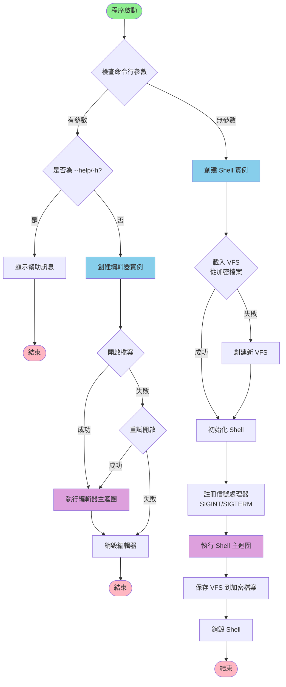
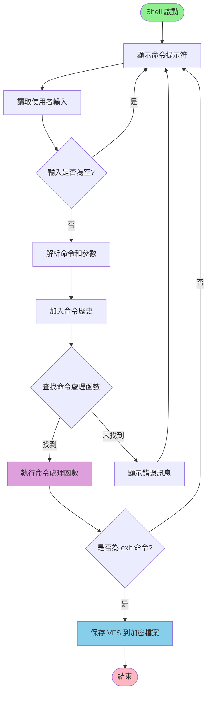
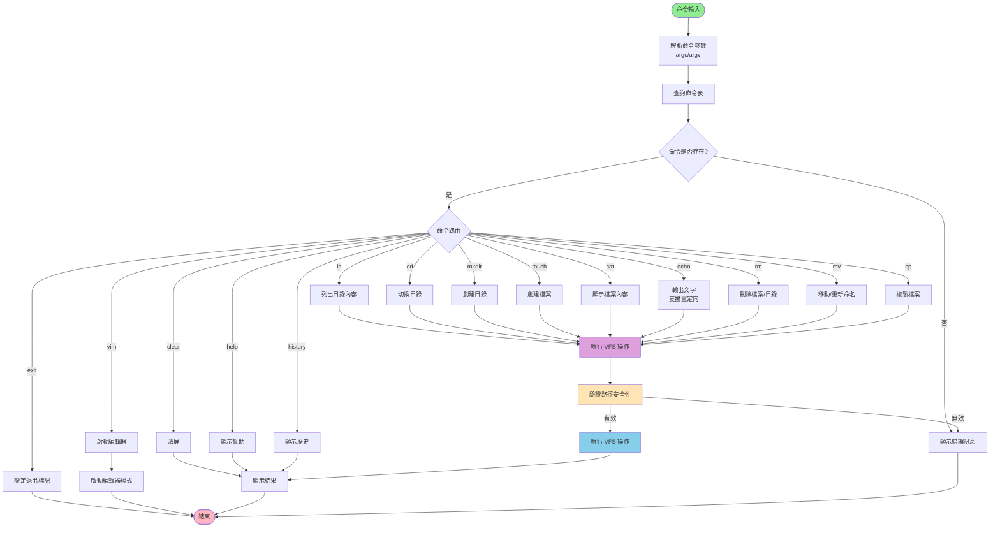
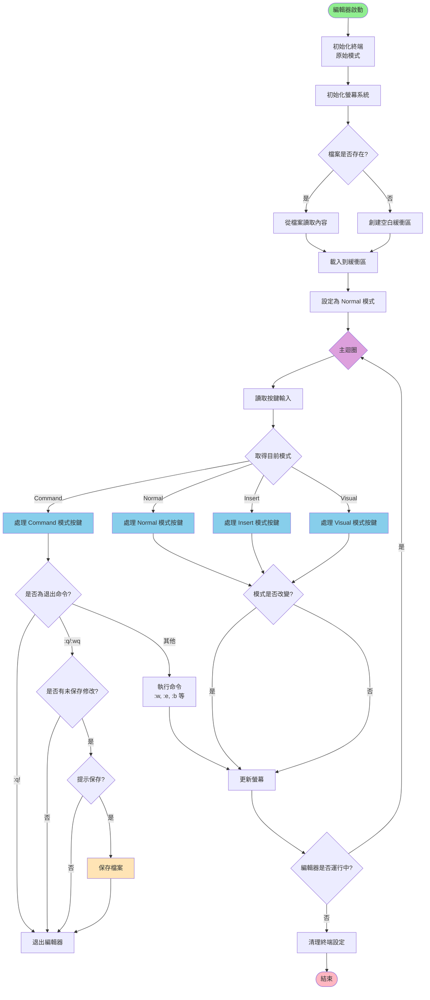
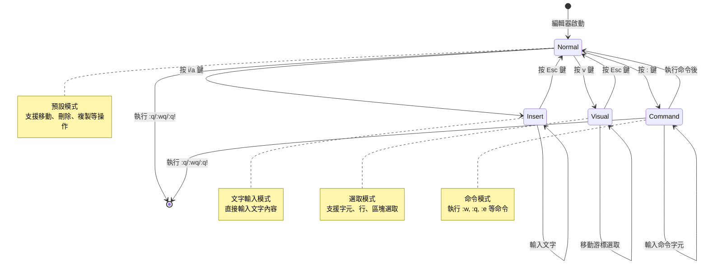
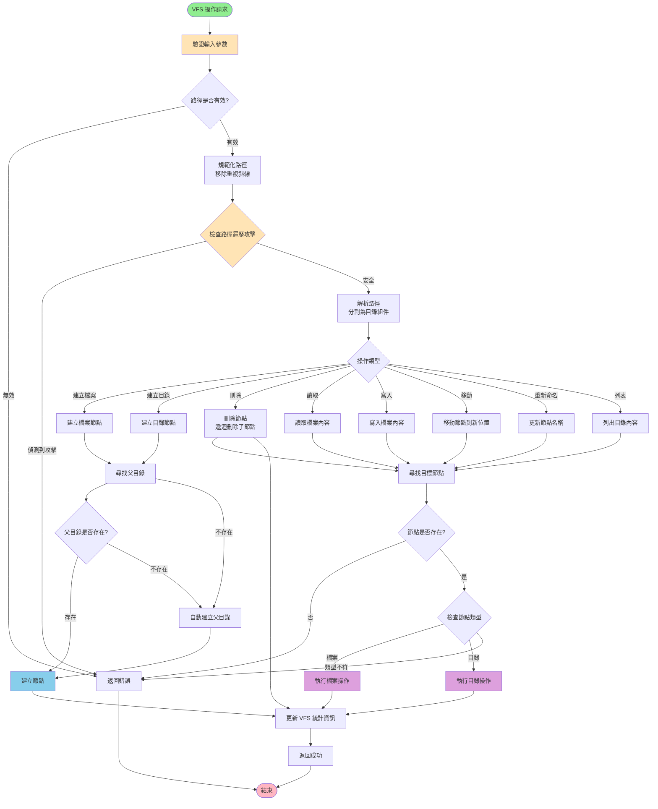
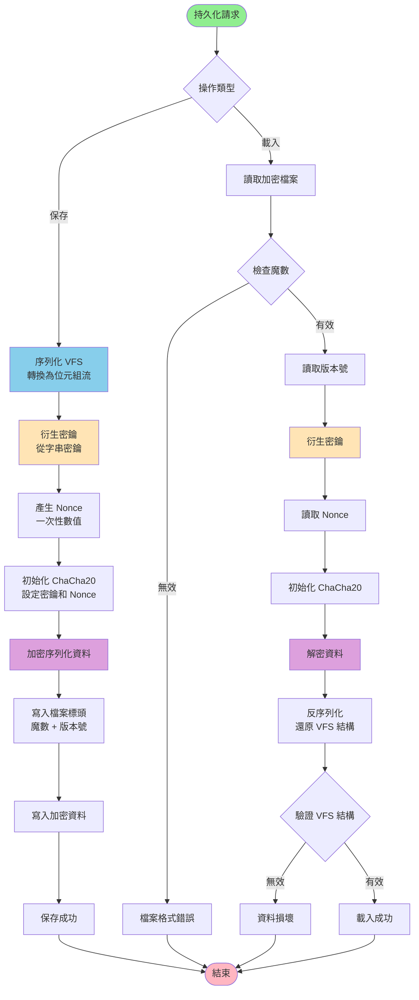
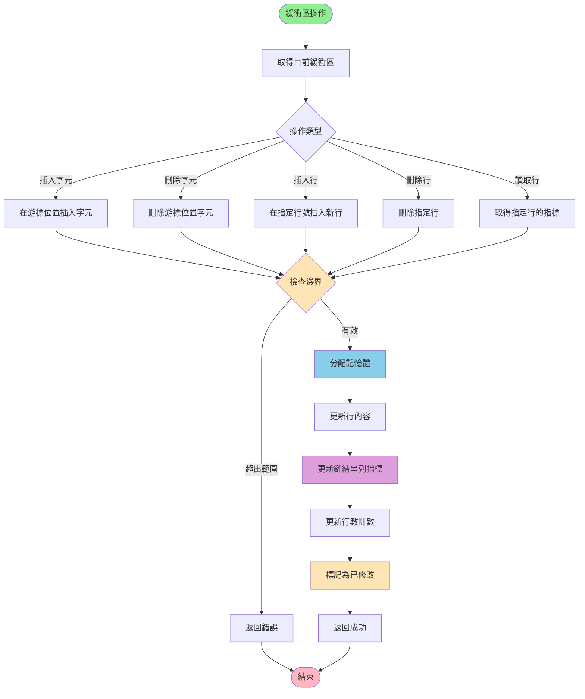
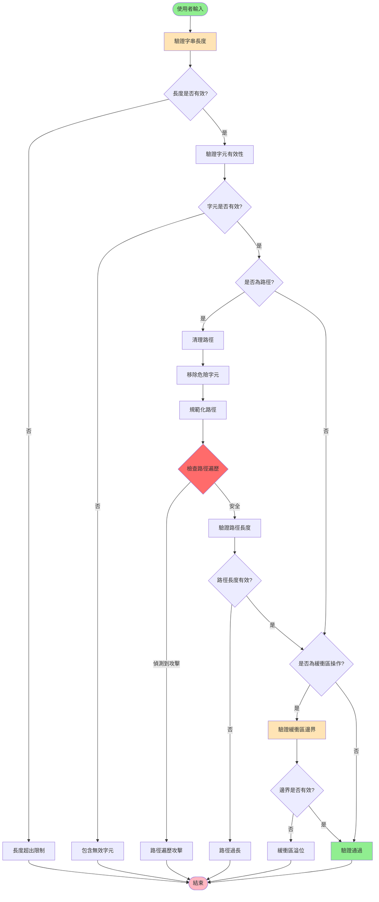
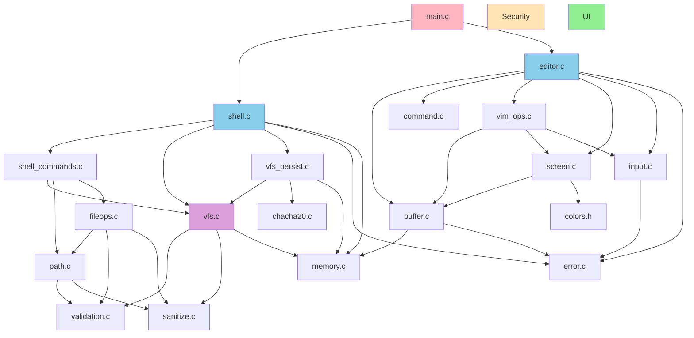

# Yun File System - 架構流程圖

本文檔使用 Mermaid 流程圖展示 Yun File System 的架構和執行流程。

## 主程序流程

## Shell 主迴圈流程

## Shell 命令執行流程

## 編輯器主迴圈流程

## 編輯器模式切換流程

## VFS 操作流程

## VFS 持久化流程

## 緩衝區操作流程

## 安全驗證流程

## 模組依賴關係

